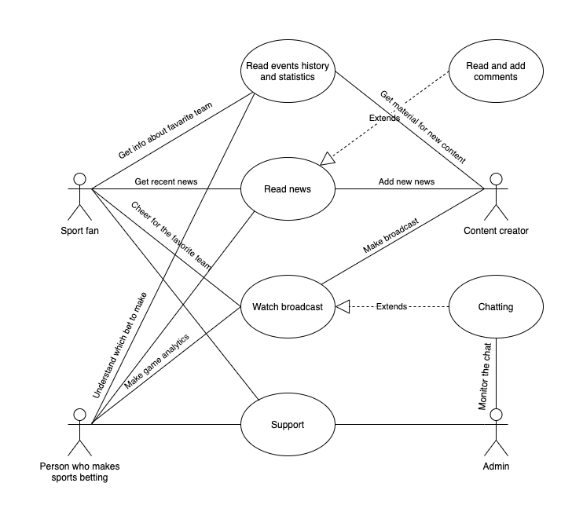

# Требования
## Классы пользователей
### Первый класс
Что делает

### Второй класс
Что делает

## Use Case диаграмма

## User Stories
### User Story 1
Как человек, который любит ставки, я хочу видеть, как другие пользователи оставляют свои мнения и прогнозы о предстоящих матчах, чтобы получать всестороннюю аналитику и сделать правильную ставку

### User Story 2
Как настоящий спортивный фанат, я хочу получать больше эксклюзивного материала о моей команде, чтобы быть в курсе всех дел в команде, больше за нее переживать

### User Story 3
Как спортивный аналитик и редактор, я хочу видеть удобный способ выкачивать статистику, чтобы проводить глубокие исследования и делать интересные статьи

## Job Stories
### Job Story 1
В день матча я хочу получать уведомление, чтобы не пропустить его

### Job Story 2
Когда проходит очередной тур чемпионата, я хочу видеть основные моменты, чтобы быть в курсе событий

### Job Story 3
Когда происходит увольнение тренера, я хочу получать статистику о выступлении его команды, чтобы проанализовать его успехи и неудачи